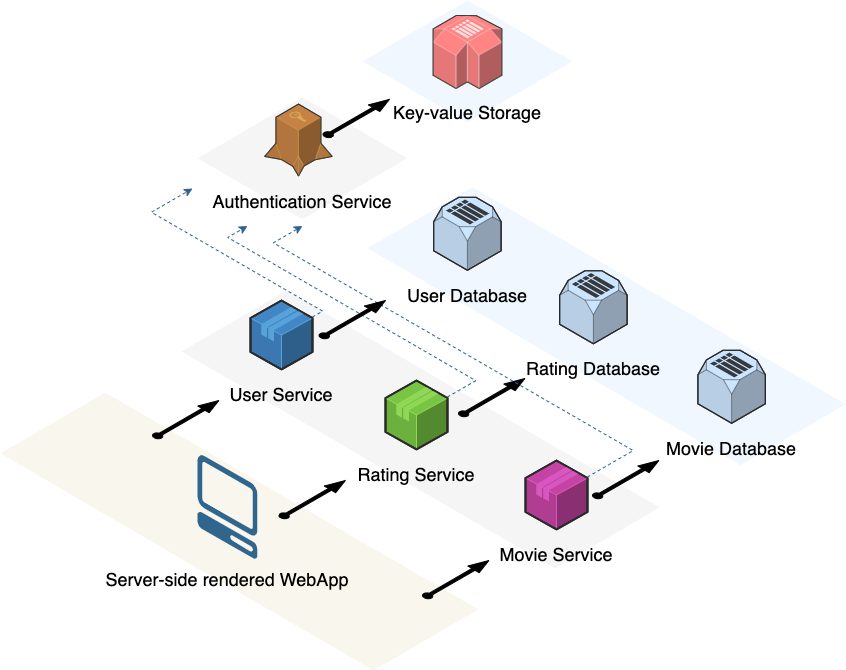

# 🍿 Movie Rating System

The original documentation containing the full challenge description is [here](README_CHALLENGE.md).

## 🚀 System Architecture in a high level



## 📚 Documentations

Each system component (service or client) is documented in its respective repository:

- ### 👤 User Service [repository](services/user)
- ### ⭐ Rating Service [repository](services/rating)
- ### 🎥 Movie Service [repository](services/movie)
- ### 💻 Client [repository](client)

## 🏃 How to run

In order to run the system locally, there are two simple alternatives. Note that both options require [Docker](https://www.docker.com/):

**1. From this directory, run:**
```bash
make compose
```
This command will spin up all the containerized components.

**2. See the [documentations](#-documentations) to learn how to start each service or client independently. For the databases, either you run your own instances of [MongoDB](https://www.mongodb.com/) or just run:**
```bash
make run-db
```
This command will spin up all the 3 MongoDB containers.

## ✅ Requirements

- [ ] The backend should expose RESTful endpoints to handle user input and
  return movie ratings.
- [ ] The system should store data in a database. You can use any existing
  dataset or API to populate the initial database.
- [x] Implement user endpoints to create and view user information.
- [ ] Implement movie endpoints to create and view movie information.
- [ ] Implement a rating system to rate the entertainment value of a movie.
- [ ] Implement a basic profile where users can view their rated movies.
- [ ] Include unit tests to ensure the reliability of your code.
- [x] Ensure proper error handling and validation of user inputs.

## ✨ Bonus Points

- [ ] Implement authentication and authorization mechanisms for users.
- [ ] Provide documentation for your API endpoints using tools like Swagger.
- [x] Implement logging to record errors and debug information.
- [ ] Implement caching mechanisms to improve the rating system's performance.
- [ ] Implement CI/CD quality gates.
