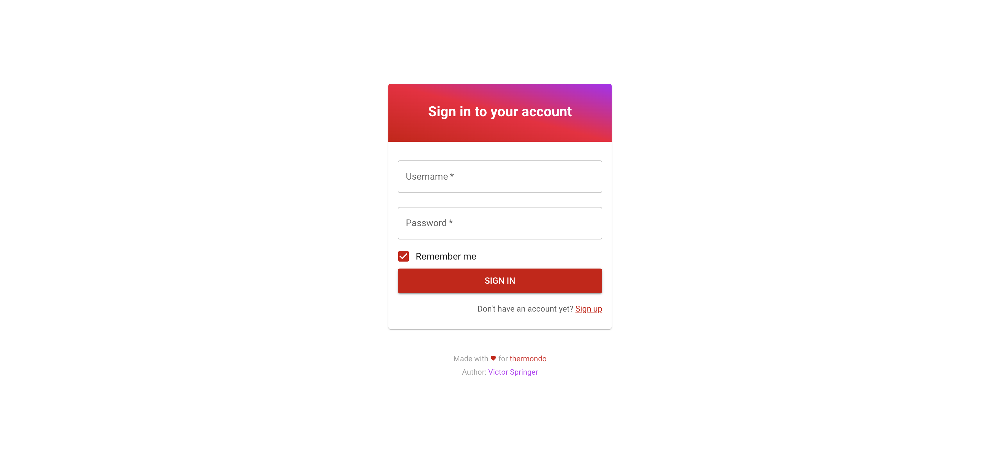
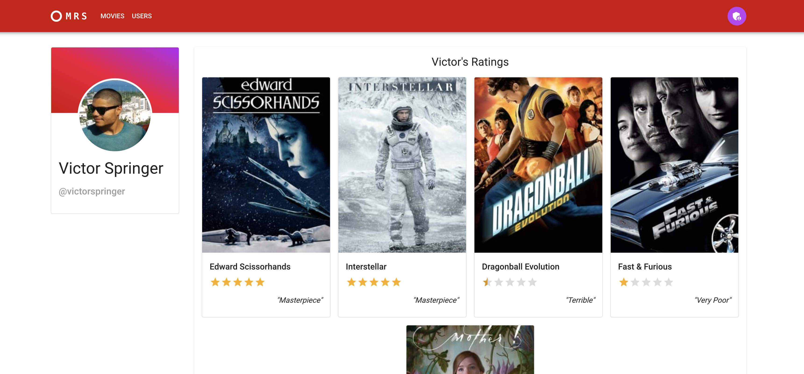

# Movie Rating System - 💻 Client

This Next.js WebApp enables a limited graphic interface for Login and user profile visualization, as well as giving the possibility to visualize and update your movie ratings in the Movie Rating System.

## Requirements

- Node.js (v18 or higher)

## Setup

1. Install dependencies using `npm install`.
2. Run the application using `make run`.

## Technologies Used

- Next.js
- TypeScript
- Material UI

## Endpoints

- `/signin`
    
    Sign in page.

    

- `/profile/{id}`

    User profile page. If the ID is the own logged in user's, it is possible to update the existing user's movie ratings. Otherwise the ratings are `read only`.

    

- `/logout`

    Logs out the user.

## Notes

- This component is out of the scope of the challenge. Therefore, due to the short deadline, it is known that is far from an ideal state (e.g. lack of tests, state management etc).

- The intention here was just to demonstrate a frontend client consuming the challenge's backend system. Please, disconsider this component from the challenge's review.
